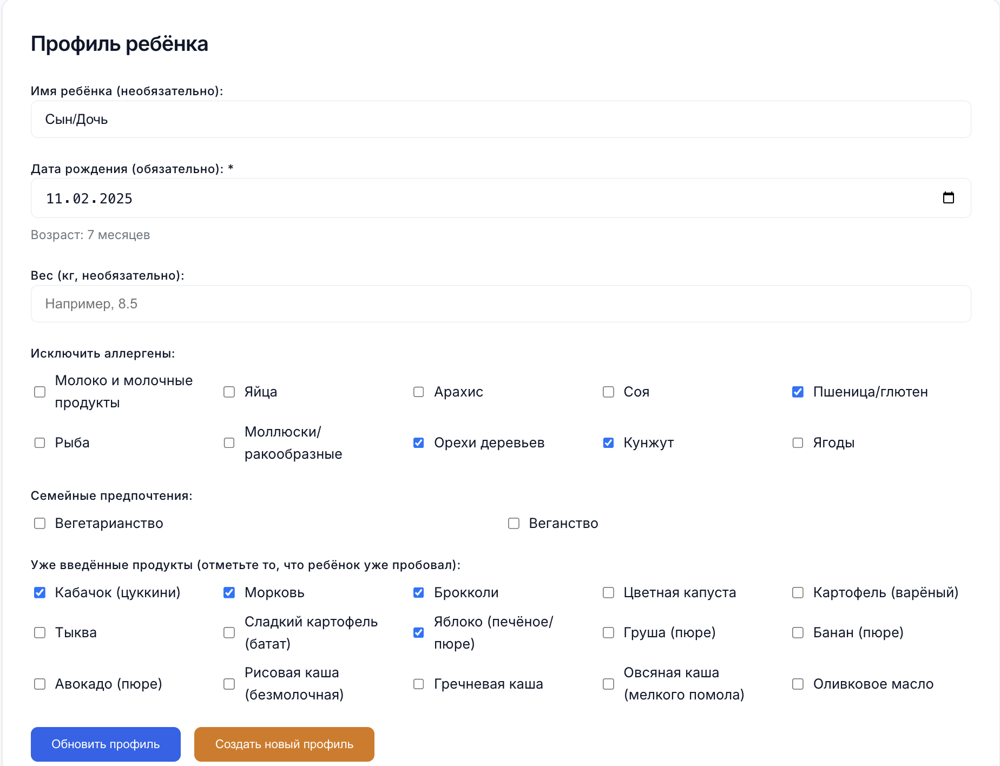
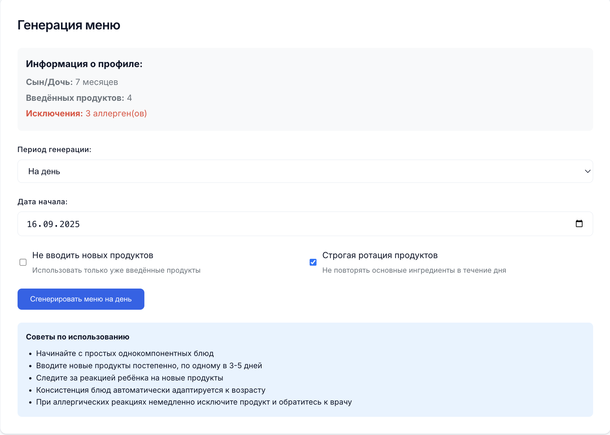
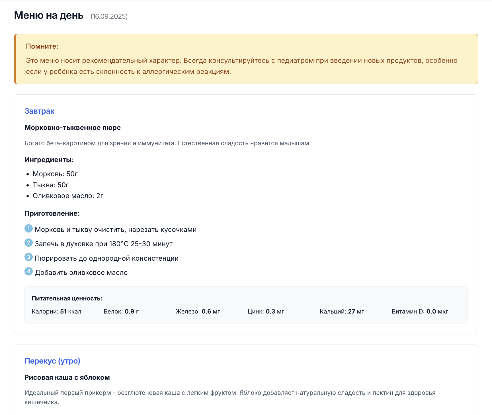
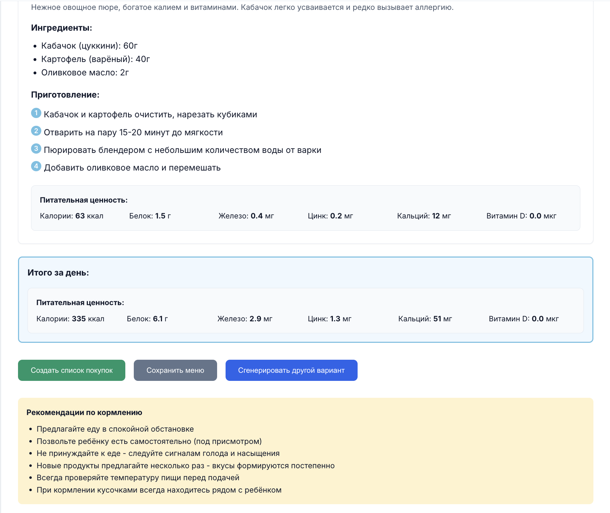

# Baby Food Generator

Веб-приложение для генерации меню прикорма детей 6-12 месяцев на основе научных рекомендаций ВОЗ, ESPGHAN и других авторитетных источников.

Попробовать как это работает можно по ссылке -> https://mendegar.github.io/Baby-Food-Generator/

## Описание

Baby Food Generator — это простое и функциональное приложение для родителей, которое помогает составлять сбалансированные меню прикорма с учётом возраста ребёнка, аллергенов и пищевых предпочтений семьи. Приложение работает полностью в браузере без необходимости регистрации или подключения к серверу.

## Возможности

- **Персонализированные профили детей** с учётом возраста и особенностей питания
- **Генерация меню** на день или неделю с автоматической ротацией продуктов
- **База рецептов** с пошаговыми инструкциями приготовления
- **Адаптация консистенции** блюд под возраст ребёнка (пюре → кусочки → finger food)
- **Расчёт питательности** с отображением ключевых нутриентов
- **Списки покупок** с возможностью экспорта в CSV
- **Система безопасности** с PIN-кодом для защиты данных
- **Экспорт/импорт профилей** для переноса между устройствами
- **Научные рекомендации** и справочные материалы

## Скриншоты

### Управление профилями


### Создание профиля ребёнка


### Введение продуктов


### Сгенерированное меню


### Рекомендации по кормлению


## Технические характеристики

- **Frontend-only**: Работает без сервера
- **Технологии**: React 18, Vite, современный CSS
- **Хранение данных**: localStorage браузера
- **Безопасность**: PIN-код защита, хеширование SHA-256
- **Экспорт данных**: JSON, CSV форматы
- **Адаптивность**: Поддержка мобильных устройств

## Быстрый старт

### Установка и запуск

```bash
# Клонирование репозитория
git clone https://github.com/yourusername/baby-food-generator.git
cd baby-food-generator

# Установка зависимостей
npm install

# Запуск в режиме разработки
npm run dev

# Сборка для продакшена
npm run build

# Предварительный просмотр сборки
npm run preview
```

### Развёртывание

Приложение готово для развёртывания на любом статическом хостинге:

- **GitHub Pages**: Загрузите содержимое папки `dist/`
- **Vercel**: Подключите репозиторий напрямую
- **Netlify**: Drag & drop папки `dist/` или подключение через Git

## Структура проекта

```
src/
├── components/          # React компоненты
│   ├── ProfileForm.jsx      # Форма профиля ребёнка
│   ├── ProfileManager.jsx   # Управление профилями
│   ├── MenuGenerator.jsx    # Генератор меню
│   ├── MenuView.jsx         # Отображение меню
│   ├── ShoppingList.jsx     # Список покупок
│   ├── SecurityScreen.jsx   # Система безопасности
│   └── ...
├── data/               # Статические данные
│   ├── products.json       # База продуктов (20+ позиций)
│   └── recipes.json        # База рецептов (15+ рецептов)
├── utils/              # Утилиты
│   ├── menuLogic.js        # Логика генерации меню
│   ├── profileManager.js   # Управление профилями
│   ├── security.js         # Система безопасности
│   └── csv.js             # Экспорт в CSV
└── styles/             # Стили
    └── index.css          # Основные стили
```

## Использование

### 1. Создание профиля ребёнка
- Укажите дату рождения (возраст рассчитается автоматически)
- Отметьте уже введённые продукты
- Выберите исключаемые аллергены
- Установите семейные предпочтения питания

### 2. Генерация меню
- Выберите период: день или неделю
- Настройте параметры ротации продуктов
- Получите персонализированное меню с рецептами

### 3. Управление данными
- Экспортируйте профили в JSON для резервного копирования
- Импортируйте данные на другом устройстве
- Создавайте списки покупок в CSV формате

## Научная база

Приложение основано на рекомендациях:

- **WHO** - Руководство по прикорму 6-23 месяца (2023)
- **ESPGHAN** - Европейские рекомендации по прикорму (2017)
- **AAP** - Американская академия педиатрии
- **Союз педиатров России** - Национальные рекомендации

## Безопасность и приватность

- **Локальное хранение**: Все данные остаются в браузере пользователя
- **PIN-код защита**: Опциональная защита доступа к профилям
- **Нет серверов**: Никакие данные не передаются третьим лицам
- **Экспорт данных**: Полный контроль над своими данными

## Ограничения и предупреждения

⚠️ **Важно**: Это приложение не заменяет консультацию с педиатром. Всегда согласовывайте план питания ребёнка с квалифицированным врачом.

### Технические ограничения:
- Работает только в современных браузерах с поддержкой ES6+
- Данные привязаны к конкретному браузеру (решается экспортом/импортом)
- Требует JavaScript для работы

## Кастомизация и доработка

### Добавление продуктов
Отредактируйте файл `src/data/products.json`:

```json
{
  "id": "new_product",
  "name": "Название продукта",
  "allowed_from_month": 6,
  "categories": ["vegetable"],
  "allergens": [],
  "typical_portion_g": 50,
  "nutrition_per_100g": {
    "kcal": 25,
    "protein_g": 1.0,
    "iron_mg": 0.5,
    "zinc_mg": 0.2,
    "calcium_mg": 20,
    "vitaminD_µg": 0
  },
  "notes": "Описание пользы продукта"
}
```

### Добавление рецептов
Отредактируйте файл `src/data/recipes.json`:

```json
{
  "id": "new_recipe",
  "title": "Название блюда",
  "ingredients": [
    { "product_id": "product_id", "grams": 50 }
  ],
  "steps": [
    "Шаг 1 приготовления",
    "Шаг 2 приготовления"
  ],
  "recommended_from_month": 6,
  "consistency": "puree",
  "notes": "Польза блюда для ребёнка"
}
```

### Изменение дизайна
Основные стили находятся в `src/styles/index.css`. Используются CSS-переменные для лёгкой кастомизации цветовой схемы.

## Совместимость браузеров

- Chrome 90+
- Firefox 88+
- Safari 14+
- Edge 90+

## Лицензия

MIT License - свободное использование и модификация.

## Вклад в проект

Приветствуются:
- Дополнения к базе продуктов и рецептов
- Переводы на другие языки
- Улучшения алгоритмов генерации меню
- Исправления ошибок и улучшения UX

### Как внести вклад:
1. Сделайте Fork репозитория
2. Создайте ветку для изменений (`git checkout -b feature/amazing-feature`)
3. Зафиксируйте изменения (`git commit -m 'Add amazing feature'`)
4. Отправьте в ветку (`git push origin feature/amazing-feature`)
5. Откройте Pull Request

## Поддержка

Если у вас есть вопросы или предложения:
- Создайте Issue в репозитории
- Опишите проблему максимально подробно
- Приложите скриншоты при необходимости

## Roadmap

Планируемые улучшения:
- [ ] Мультиязычность (английский, немецкий)
- [ ] Расширенная база продуктов (50+ позиций)
- [ ] Интеграция с API питательности USDA
- [ ] Мобильное приложение (PWA)
- [ ] Печать меню в PDF
- [ ] Система напоминаний

---

**Создано для заботливых родителей 👶**

*Помните: здоровое питание с раннего возраста — основа крепкого здоровья на всю жизнь.*
